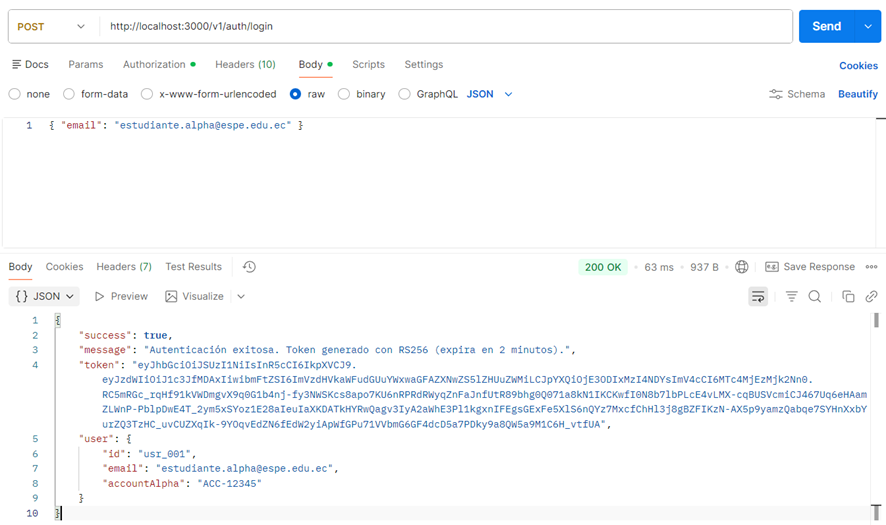
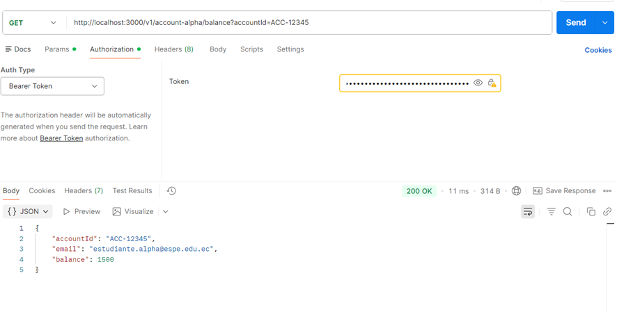
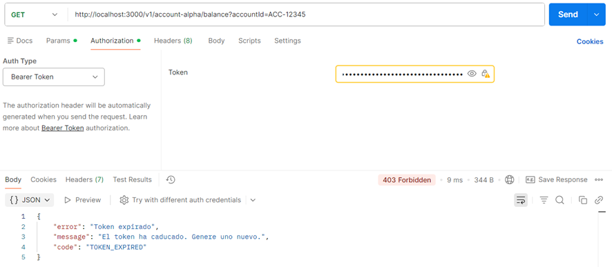
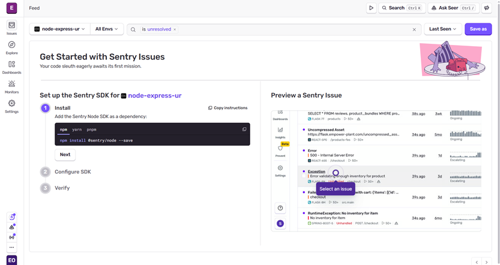
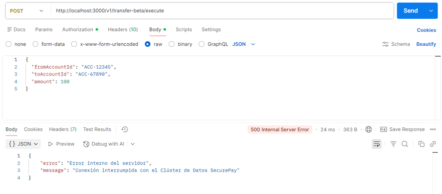
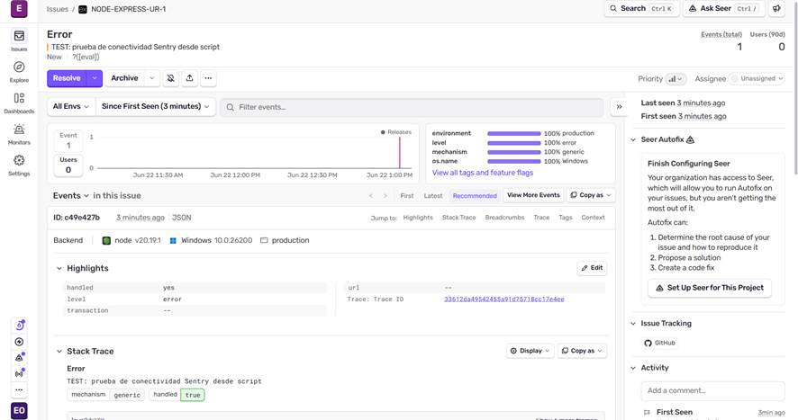
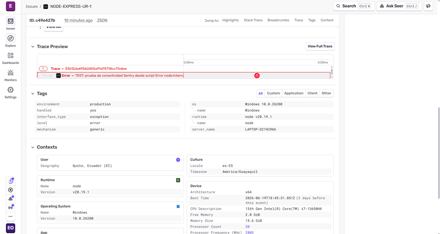

# 🏦 Fintech SecurePay — Bitácora de Evaluación Parcial

**Universidad de las Fuerzas Armadas ESPE**  
**Departamento de Ciencias de la Computación | Ingeniería de Software**  
**Asignatura:** Aplicaciones Distribuidas 
**Estudiante:** Erick Pobando    

---

## 📋 Resumen del Proyecto

Sistema de pagos distribuidos SecurePay refactorizado aplicando principios SOLID, autenticación asimétrica JWT RS256 y observabilidad con Sentry.

---

## Refactorización SOLID (SRP + DIP)

### Problema identificado
El archivo `transaction.monolith.service.js` original violaba el **Principio de Responsabilidad Única (SRP)**: mezclaba validación, cálculo contable, persistencia y notificaciones en una sola función.

### Solución aplicada

| Servicio | Responsabilidad única |
|---|---|
| `validation.service.js` | Solo valida existencia de cuentas y saldo suficiente |
| `ledger.service.js` | Solo ejecuta débitos/créditos y persiste transacciones |
| `notification.service.js` | Solo emite notificaciones (simulación de email) |
| `transaction.monolith.service.js` | Orquestador: recibe los 3 servicios por constructor (DIP) |

### Diagrama de Dependencias (DIP)
```
TransactionService (Orquestador)
    ├── ValidationService  ← inyectado por constructor
    ├── LedgerService      ← inyectado por constructor
    └── NotificationService ← inyectado por constructor
```

---

## Autenticación Stateless JWT RS256

1. `POST /v1/auth/login` → el servidor firma un JWT con `private.pem` usando RS256
2. El cliente incluye el token en `Authorization: Bearer <token>`
3. El middleware verifica con `public.pem` de forma **autónoma y stateless**
4. Claims del payload: `sub` (userId), `name` (email), `exp` (2 minutos)

### Login exitoso (token generado)



---

### Acceso válido con token activo



---

### Token expirado (403)


---

## Observabilidad con Sentry

### Reglas de observabilidad implementadas

| Tipo de error | Código HTTP | Reporta a Sentry |
|---|---|---|
| Token malformado / expirado | 401 / 403 | ❌ NO (error lógico esperado) |
| Fallo de conexión al clúster de datos | 500 | ✅ SÍ (error operacional) |

### Creacion del proyecto en Sentry



### Error 500 operacional en Postman


---

### Panel Sentry con el error capturado



---

## 🚀 Instrucciones de ejecución

```bash
# 1. Clonar el repositorio
git clone https://github.com/Tenkenoz/SecurePay.git
cd SecurePay

# 2. Instalar dependencias
npm install

# 3. Generar llaves criptográficas
./keypair.sh

# 4. Configurar variables de entorno
cp .env.example .env
# Editar .env con tu SENTRY_DSN

# 5. Ejecutar el servidor
node index.js
```

### Endpoints disponibles

| Método | Endpoint | Descripción | Auth requerida |
|---|---|---|---|
| POST | `/v1/auth/login` | Genera token JWT RS256 | No |
| GET | `/v1/account-alpha/balance?accountId=ACC-12345` | Consulta saldo | ✅ Bearer Token |
| POST | `/v1/transfer-beta/execute` | Ejecuta transferencia (dispara error 500) | ✅ Bearer Token |
